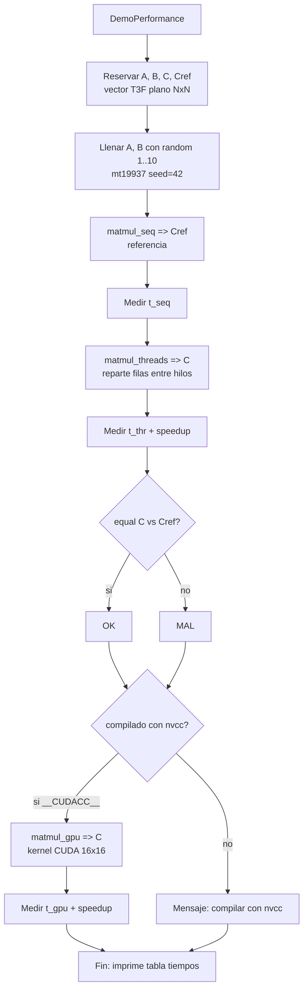
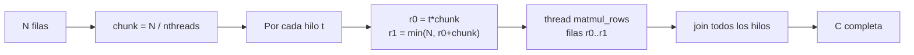
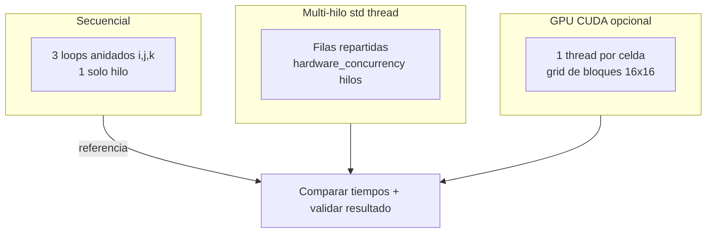
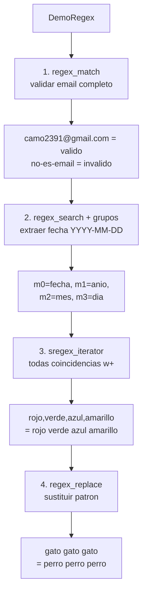
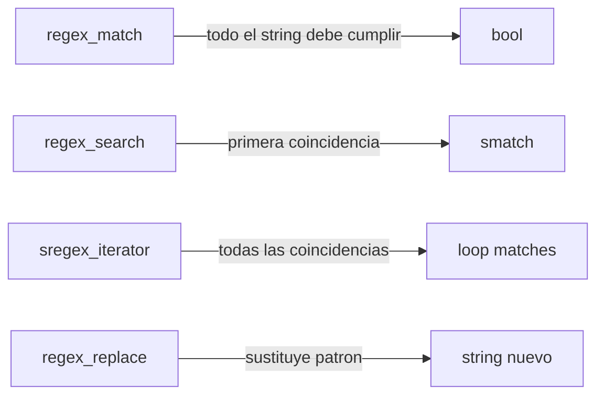

# Demos: Performance y Regex

Diagramas Mermaid de los dos demos invocados desde `main.cpp`.

---

## DemoPerformance (`performance.cpp`)

Compara multiplicación de matrices `NxN` (N=1000) con 3 estrategias y mide tiempos.

### Detalle multi-hilo (`matmul_threads`)

### Estrategias comparadas

---

## DemoRegex (`regexdemo.cpp`)

4 usos de `std::regex` sobre strings (`TS = std::string`).

### Match vs Search vs Iterator vs Replace

