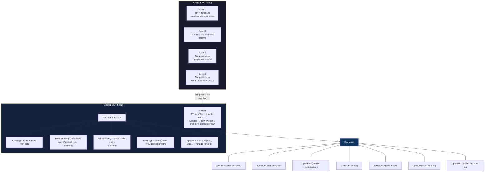
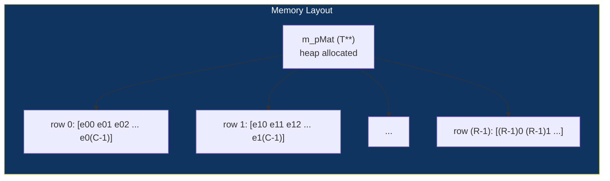
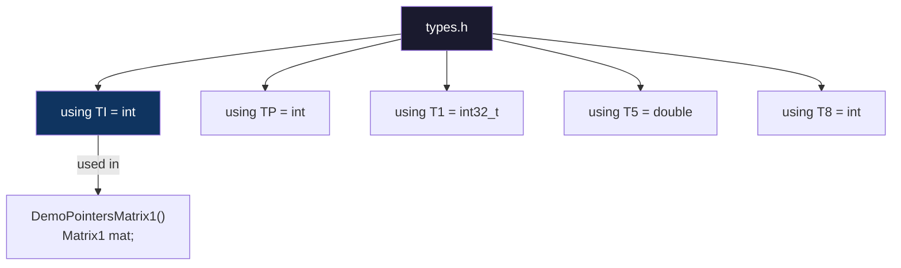

# Matrices Architecture - PR #12

## Evolution: Array → Matrix



## Internal Storage Structure



## Class Definition

```mermaid
classDiagram
    class Matrix1~T~ {
        +T** m_pMat
        +size_t m_rows
        +size_t m_cols
        +Matrix1()
        +~Matrix1()
        +Matrix1(copy)
        +Matrix1(move)
        +operator=(copy)
        +operator=(move)
        +Create()
        +Read(istream)
        +ApplyFunctionToAll(func, args...)
        +Print(ostream)
        +Destroy()
        +operator+(Matrix1)
        +operator-(Matrix1)
        +operator*(Matrix1)
        +operator*(T)
    }

    Matrix1 --|> "copyable"
    Matrix1 --|> "movable"
```

## Data Flow

```mermaid
flowchart LR
    SS["istringstream<br/>'3 4 1 2 3 4 5 6 7 8 9 10 11 12'"]
    SS -->|">>"| READ["Read()"]
    READ -->|rows=3 cols=4| CREATE["Create()"]
    CREATE -->|new T*[3]| PTR["m_pMat"]
    CREATE -->|new T[4] x3| ROWS["row allocations"]
    READ -->|read elements| ROWS

    PTR -->|m_pMat[0]| R0["[1 2 3 4]"]
    PTR -->|m_pMat[1]| R1["[5 6 7 8]"]
    PTR -->|m_pMat[2]| R2["[9 10 11 12]"]

    style SS fill:#1a1a2e,color:#fff
    style READ fill:#16213e,color:#fff
    style CREATE fill:#16213e,color:#fff
    style PTR fill:#0f3460,color:#fff
    style ROWS fill:#0f3460,color:#fff
```

## Matrix Multiplication (A * B)

```mermaid
flowchart LR
    subgraph A["Matrix A (MxK)"]
        A0["m_rows=M, m_cols=K"]
    end
    subgraph B["Matrix B (KxN)"]
        B0["m_rows=K, m_cols=N"]
    end
    subgraph R["Result (MxN)"]
        R0["m_rows=M, m_cols=N"]
        R0 -->|R[i][j] = sum| SUM["Σ A[i][k] * B[k][j]"]
    end

    A -->|cols=K| SUM
    B -->|rows=K| SUM
    SUM --> R

    style A fill:#1a1a2e,color:#fff
    style B fill:#1a1a2e,color:#fff
    style R fill:#16213e,color:#fff
```

## Type Aliases

